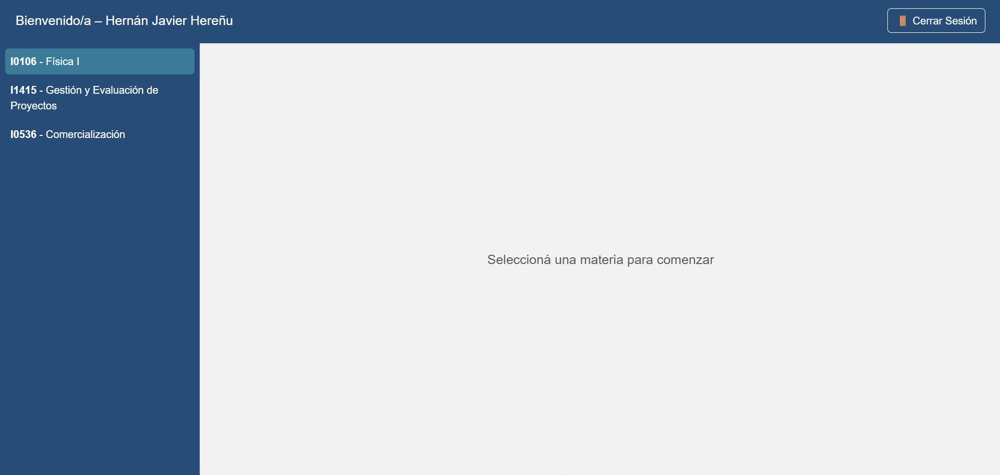

1.	Introduzca su correo institucional y contraseña en los campos correspondientes del moodle. 
  
2.	Ingrese al portal institucional de Edu 2.0.    

3.	Una vez autenticado, el sistema mostrará la pantalla principal con su nombre completo, el código y nombre de la materia actual, y un panel lateral con las demás materias inscriptas.

{ width="100%" align="center" }