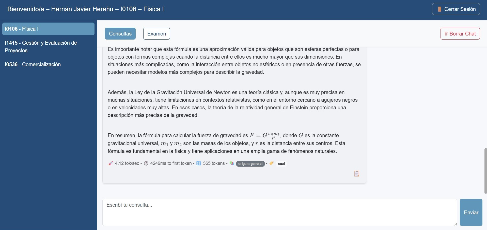

En la pestaña Consultas, el alumno puede escribir preguntas relacionadas con la materia activa.  

El sistema, basado en inteligencia artificial, analiza el contenido de los apuntes y responde de manera detallada.  

Cada respuesta incluye:  

•	Indicadores de rendimiento: tokens generados, velocidad de respuesta (tok/sec) y tiempo al primer token.  

•	Referencias a los apuntes utilizados (nombre del PDF y tema relacionado).  

⚙️ Nota: En la versión actual no existen botones de “Regenerar respuesta” ni “Continuar texto”; las consultas se procesan automáticamente al enviar el mensaje.  

{ width="100%" align="center" }

