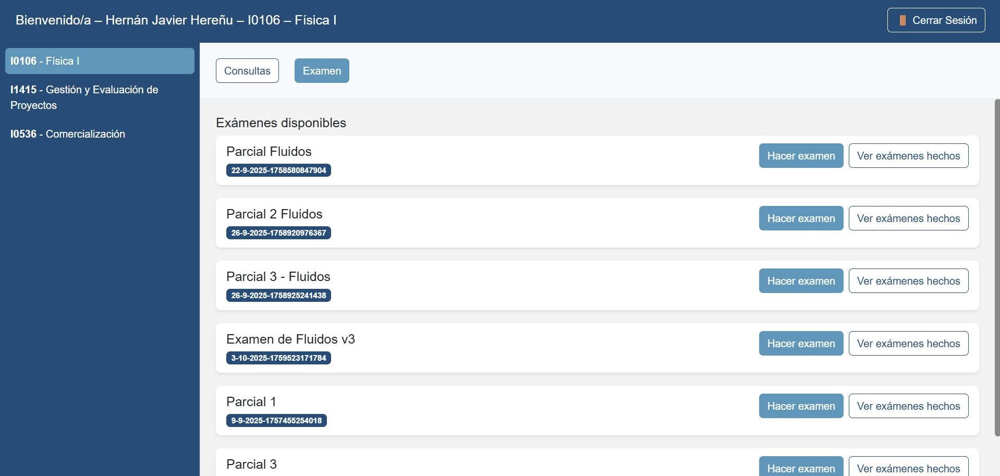

En la pestaña Examen, el alumno visualiza la lista de evaluaciones activas para la materia seleccionada.  

Cada examen se muestra en una tarjeta con:  

•	**Nombre del examen**  

•	**Código único de idntificación**  

•	**Estado de intentos registrados**  
  
  
**Botones de acción**  

- 	Hacer examen → iniciar una nueva evaluación.  

- 	Ver exámenes hechos → revisar intentos anteriores.  

- 	Ocultar → colapsar la vista del examen actual.  

{ width="100%" align="center" }
