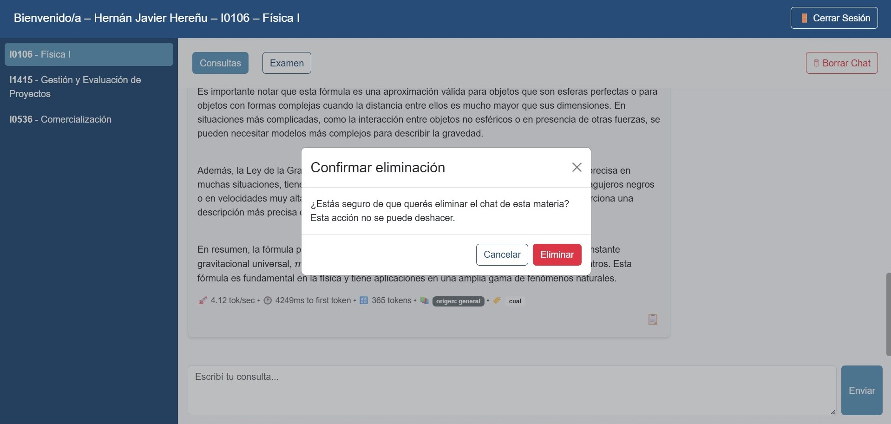

El historial de consultas se guarda automáticamente y se carga al reabrir la materia.  

Para limpiar la conversación visible, presione Borrar Chat.  

El sistema solicitará confirmación antes de eliminar los mensajes mostrados.  
(la información permanece almacenada en la base de datos para fines académicos)  

{ width="100%" align="center" }

