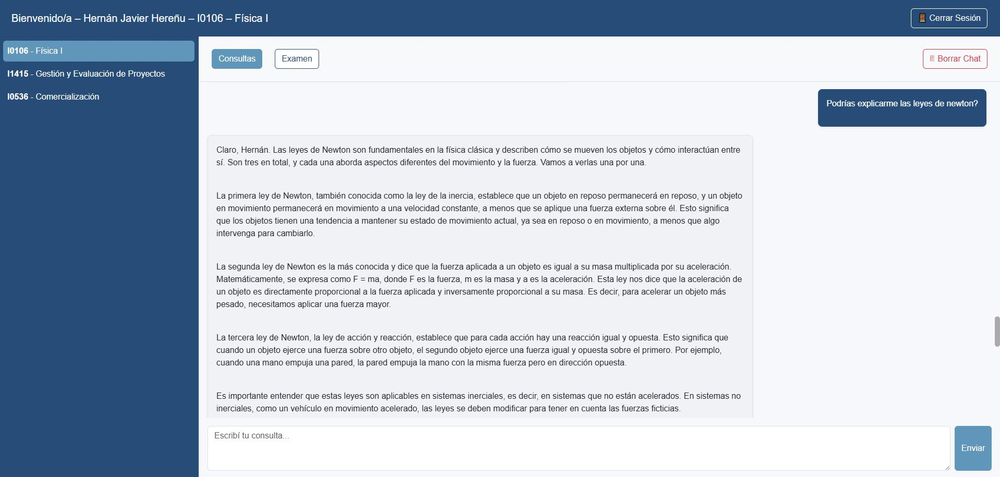

La pantalla principal tiene una estructura simple y organizada:  

-	Barra lateral izquierda: materias disponibles.  

-	Encabezado superior: nombre del alumno y botones Cerrar Sesión y Borrar Chat.  

-	Pestañas superiores: Consultas y Examen.  

-	Área central: muestra los mensajes y respuestas del sistema.  

-	Caja inferior: campo “Escribí tu consulta…” y botón Enviar.  

{ width="100%" align="center" }
