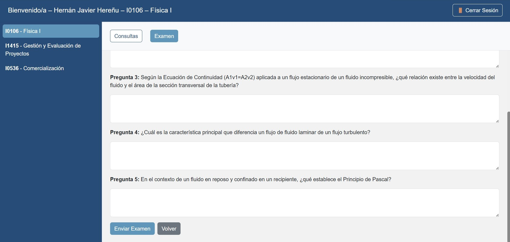
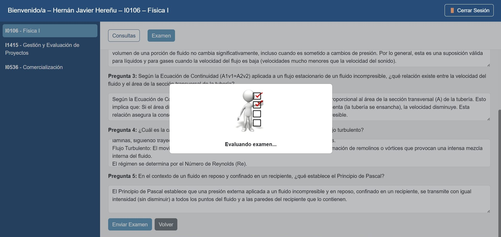

1.	Presione Hacer examen.
2.	Complete las preguntas presentadas, que pueden ser:
    - Respuesta abierta (campo de texto).
    - Selección múltiple (si está habilitado).
3.	Revise sus respuestas antes de enviarlas.
4.	Presione Enviar Examen para finalizar.
5.	El sistema mostrará una animación y el mensaje “Evaluando examen…”, mientras la IA analiza las respuestas.

{ width="50%" align="center" }  

{ width="50%" align="center" }
