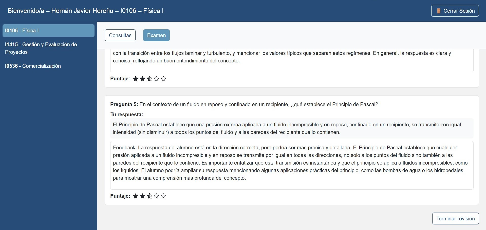

Al finalizar la evaluación, el sistema devuelve una calificación numérica (0 a 10) y una visualización en forma de estrellas (★).  

Cada pregunta incluye:  

- La respuesta del alumno.  

- Un feedback generado por IA, que explica los aciertos o aspectos a mejorar.  

- El puntaje parcial correspondiente.

El alumno puede acceder en cualquier momento al historial de exámenes desde Ver exámenes hechos, donde encontrará:  

- Fecha de realización.  

- Calificación obtenida.  

- Enlace para ver el detalle de cada intento.  

{ width="100%" align="center" }
