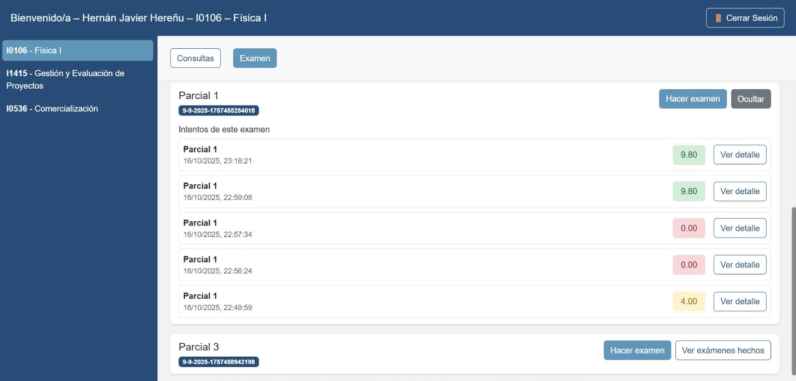

En el historial de exámenes, cada intento conserva:  

- El nombre del examen  

- La fecha y hora de realización  

- El puntaje final y acceso a “Ver detalle”  

El alumno puede comparar resultados y observar su progreso académico a lo largo del curso.  

{ width="100%" align="center" }

